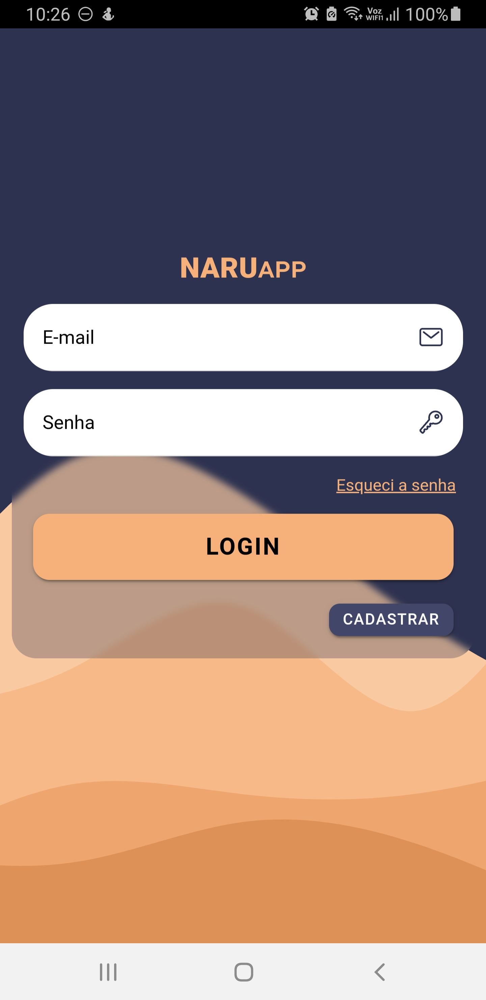
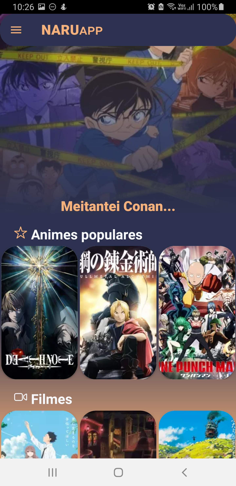
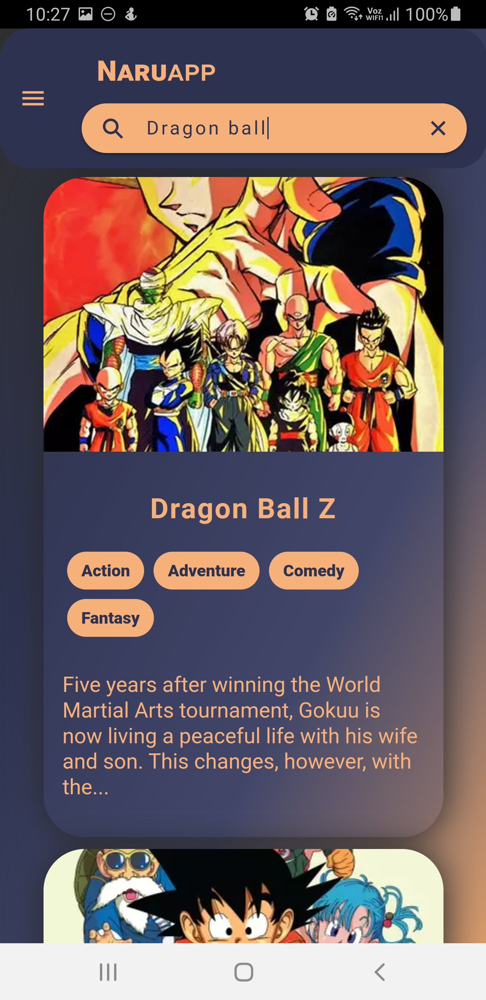
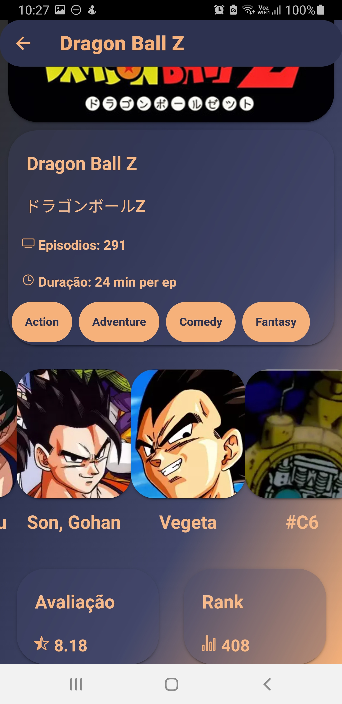

Embora o teste solicite a integração com a PokeAPI, compartilho aqui um projeto similar que desenvolvi utilizando a JikanAPI (API de animes). Ele possui estrutura e funcionalidades semelhantes às do teste solicitado, além de incluir autenticação de usuários com Firebase. Acredito que esse projeto demonstra de forma mais completa minha capacidade técnica e minha familiaridade com esse tipo de aplicação.

# Naru-App

Projeto em Ionic Angualar para pesquisar animes usando Jikan API (v4). usando Firebase e Swiper.
 
Project using Ionic Angular to search anime using Jikan API (v4). Using Firebase and Swiper.

## login page

## Home page

## Details page

